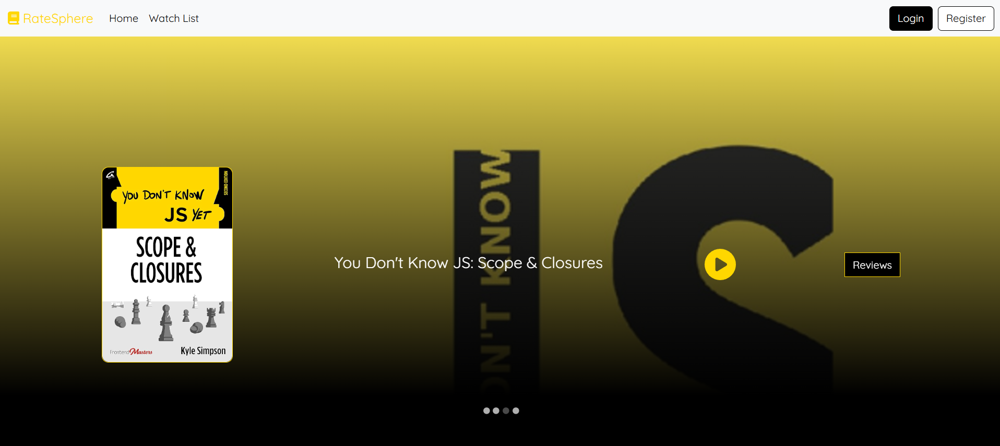
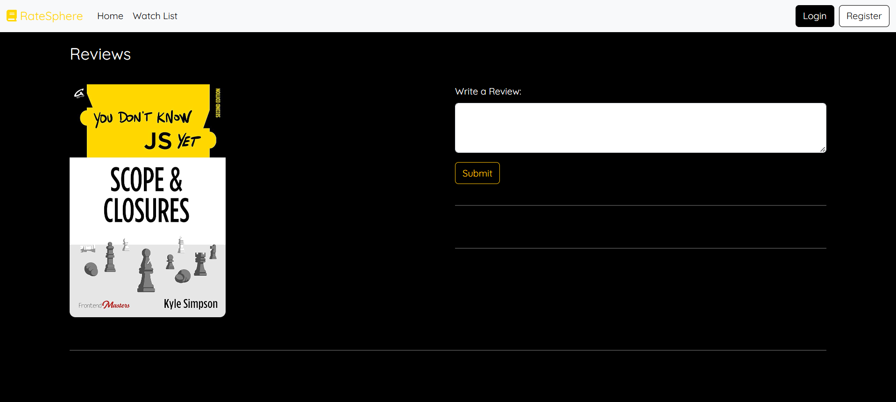

# RateSphere

1. 
2. 

---

## Description
RateSphere is a web application that allows users to browse books, watch trailers, and read or write reviews for their favorite titles. The platform provides an intuitive interface for exploring books, managing a watchlist, and sharing thoughts with a community.

---

## Features
- **Home Page**: Displays a carousel of books with options to watch trailers and read reviews.
- **Book Reviews**: Allows users to view and add reviews for specific books.
- **Trailer Page**: Plays a YouTube trailer for the selected book.
- **Responsive Design**: Adapts to various screen sizes.

---

## Tech Stack
- **Frontend**: React, React Router, React Bootstrap, Material-UI
- **Backend**: Spring Boot, Axios for API calls
- **Database**: MongoDB
- **Styling**: CSS, Bootstrap

---

## Installation

1. Clone the repository:
   ```bash
   git clone https://github.com/azizbelkhouja/ratesphere.git
   ```

2. Navigate to the project directory:
   ```bash
   cd ratesphere
   ```

3. Install dependencies:
   ```bash
   npm install
   ```

4. Start the development server:
   ```bash
   npm start
   ```

5. Open [http://localhost:3000](http://localhost:3000) in your browser.

---

## Folder Structure
```
.
|-- public
|-- src
|   |-- api
|   |   |-- axiosConfig.js
|   |-- components
|   |   |-- header
|   |   |   |-- Header.js
|   |   |-- home
|   |   |   |-- Home.js
|   |   |-- hero
|   |   |   |-- Hero.js
|   |   |-- layout
|   |   |   |-- Layout.js
|   |   |-- notFound
|   |   |   |-- NotFound.js
|   |   |-- reviews
|   |   |   |-- Reviews.js
|   |   |-- trailer
|   |   |   |-- Trailer.js
|   |-- App.js
|   |-- index.js
|   |-- App.css
|   |-- index.css
|-- package.json
```

---

## API Endpoints
- `GET /api/v1/books`: Fetches a list of all books.
- `GET /api/v1/books/:bookId`: Fetches details of a specific book.
- `POST /api/v1/reviews`: Adds a new review to a specific book.

---

## Deployment
1. Build the project:
   ```bash
   npm run build
   ```

2. Deploy the `build` folder to your hosting service (e.g., Netlify, Vercel, AWS).

---

## Contributing
Contributions are welcome! Please fork the repository and submit a pull request.

---


